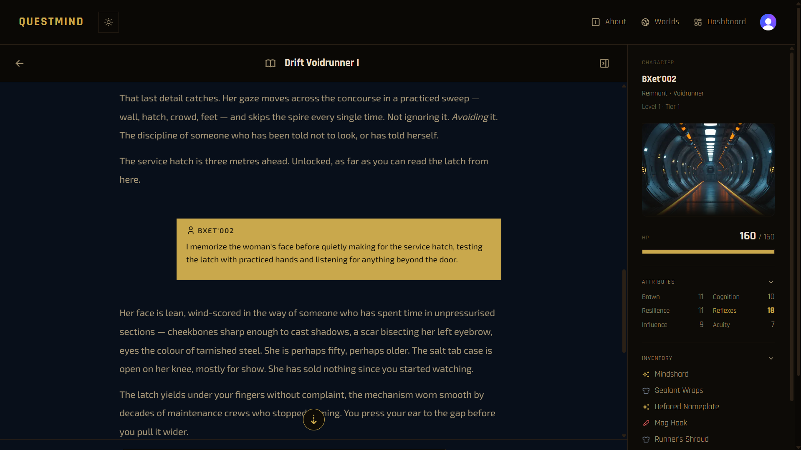

# QuestMind

An AI Game Master for solo tabletop role-playing. Create a character, pick a world, and play through an open-ended story by typing what you want to do — the AI narrates the outcome and keeps your character sheet up to date while you play.



---

## The problem

Tabletop RPGs need a group, a schedule, and an experienced Game Master. Scheduling and finding a GM are the two most-cited barriers to regular play. Existing digital alternatives sit at one of two extremes: interactive fiction pre-scripts every branch and removes real agency, while general-purpose AI chat has no game underneath it — no stats, no inventory, no consequences that persist.

QuestMind couples an LLM narrator with a structured game-state layer. The model writes prose; the server rules on what actually happened. Every turn returns both a narrative and a validated state delta, so HP, inventory, quests and progression are tracked by the application rather than remembered by the model.

## Features

|  |  |
| --- | --- |
| **AI Game Master** | Streaming, turn-based narration that responds to any player input |
| **Structured game state** | Each turn returns a JSON state block, validated field-by-field before it reaches the database |
| **Three authored worlds** | Tréigthe (dark fantasy), The Drift (sci-fi), Neon Warszawa 2087 (cyberpunk) |
| **Character progression** | XP, levels, tiers and tier-gated abilities, all derived server-side from a single stored value |
| **Retrieval-augmented lore** | Relevant locations, NPCs and world events are retrieved per turn and injected into the prompt |
| **Persistent campaigns** | Close the browser and resume exactly where you left off, with full history |
| **Multilingual play** | Narration is pinned to the campaign's language regardless of what the player types |
| **World reference** | In-game lore modal with region map, peoples, trades, places and glossary |

## How a turn works

```
player input
     │
     ▼
build-turn-request      system prompt + retrieved lore + transcript
     │
     ▼
Anthropic Messages API  (streaming)
     │
     ├──────────► prose ──────────────► streamed to the player as it arrives
     │
     └── ---JSON--- ── state block ──┐
                                     ▼
                          extract-snapshot     parse → recover → repair → validate
                                     │
                                     ▼
                          apply-turn-effects   XP, level, tier, max HP, capstone burn
                                     │                (server-authoritative)
                                     ▼
                          persist-turn         lore write, message, last-played
                                     │
                                     ▼
                          snapshot returned to the client, panel updates
```

Three properties of this pipeline are worth calling out, because they are what separate it from a chat wrapper:

**The server rules, the model narrates.** XP is awarded per turn by the application, never by the model. The model is told the current xp/level/tier because they gate which abilities it may narrate, but anything it sends back for those fields is discarded. The same applies to abilities: a name outside the character's active set is dropped before it can reach the UI.

**A bad field costs a field, not a turn.** State validation is per-field rather than a single schema parse. An invalid `inventory` reverts to its previous value and is logged; the rest of the turn — including the prose the player has already read — stands. An all-or-nothing parse would discard a whole turn for one fumbled key.

**A missing state block is recoverable.** If the model ends on prose without emitting a state block, a second, much smaller call asks only for the state that prose implies, using the previous snapshot as the contract. The result goes through the same validation as a normal turn.

## Tech stack

| Layer      | Choice                                                   |
| ---------- | -------------------------------------------------------- |
| Framework  | Next.js 16 (App Router, Turbopack), React 19             |
| Language   | TypeScript                                               |
| Styling    | Tailwind CSS v4                                          |
| Auth       | Clerk                                                    |
| Database   | PostgreSQL (Neon serverless) via Drizzle ORM             |
| AI         | Anthropic Claude API, streamed through the Vercel AI SDK |
| Validation | Zod — world definitions, state blocks, seed data         |
| Testing    | Vitest 4                                                 |

## Getting started

### Prerequisites

- Node.js 20 or newer
- pnpm
- A PostgreSQL database (Neon's free tier is sufficient)
- An Anthropic API key
- A Clerk application

### Install

```bash
git clone https://github.com/rafalq/questmind.git
cd questmind
pnpm install
```

### Environment

Create `.env.local` in the project root:

```bash
# Database
DATABASE_URL="postgresql://..."

# Anthropic
ANTHROPIC_API_KEY="sk-ant-..."
ANTHROPIC_MODEL="claude-sonnet-4-6"   # optional; this is the default

# Clerk — both keys must come from the same Clerk instance
NEXT_PUBLIC_CLERK_PUBLISHABLE_KEY="pk_test_..."
CLERK_SECRET_KEY="sk_test_..."

# Optional, development only
ENABLE_DEBUG_COMMANDS="true"
```

> Mismatched Clerk keys produce an infinite redirect loop on first load. If you see one, check that the publishable and secret keys are from the same instance.

### Database

```bash
pnpm drizzle-kit push          # apply the schema
```

Then seed the worlds. Each script seeds one world or one city, and they are **not idempotent** — run them against an empty database:

```bash
npx tsx src/db/seed/treigthe.ts        # Tréigthe (fantasy) + Cathair Luaith
npx tsx src/db/seed/baile-fola.ts      # additional Tréigthe city
npx tsx src/db/seed/drift.ts           # The Drift (sci-fi)
npx tsx src/db/seed/tetherport.ts      # additional Drift location
npx tsx src/db/seed/neon-warszawa.ts   # Neon Warszawa 2087 (cyberpunk)
npx tsx src/db/seed/praga.ts           # additional Neon Warszawa district
```

### Run

```bash
pnpm dev
```

Open [http://localhost:3000](http://localhost:3000).

## Project structure

```
src/
├── app/                  Routes and API handlers (App Router)
│   ├── api/game/         Turn loop and opening narration endpoints
│   └── (dashboard)/      Authenticated campaign and character screens
├── components/           Shared UI primitives (modal, buttons, marketing sections)
├── features/             Vertical slices, each owning its own components,
│   ├── campaign/           actions, queries, hooks and lib
│   ├── character/
│   ├── lore/             Retrieval, the lore modal, NPC portraits
│   └── session/          The turn loop, prompt building, state validation
├── db/
│   ├── schema/           Drizzle table definitions
│   └── seed/             World seed scripts
├── worlds/               Zod-validated world registry — races, classes,
│                         abilities, glossaries, scene maps
├── hooks/                Cross-cutting React hooks
├── lib/                  AI client and configuration, theming helpers
└── styles/               Global CSS, fonts
```

The **world registry** in `src/worlds/` is the single source of truth for everything a world contains. The character wizard, the lore modal, the marketing pages and the system prompt all read from it, so a world cannot describe a race the player is unable to create.

## Testing

```bash
pnpm vitest run          # once
pnpm vitest              # watch
```

Current coverage centres on the parts that are pure functions and therefore cheap to test at high value: state-block validation and repair, lore resolution, and character progression. The state-block suite also includes asset-consistency checks — every mapped scene image exists on disk, and every genre defines a fallback — because a missing asset throws nowhere and surfaces only as a silently blank panel.

## Debug commands

With `ENABLE_DEBUG_COMMANDS=true` in a non-production environment, the chat accepts commands that bypass the model and return a state delta directly. They are hard-gated: in production they are inert regardless of input.

```
/set xp 500
```

## Documentation

- [`docs/data-model.md`](docs/data-model.md) — deferred design decisions, delivered features, and the reasoning behind both. Items are marked rather than deleted once delivered, so the record shows what was weighed and what changed the decision.
- [`docs/refactor-plan.md`](docs/refactor-plan.md) — refactor audit and remaining queue.

## Academic context

Submitted for the Project Module of the Higher Diploma in Science in Computing (Software Development) at the National College of Ireland, 2025/2026.

**Author:** Rafal Kruszewski

World content, lore and glossaries are original. Character portraits, scene illustrations and region maps were generated with Leonardo.ai.
